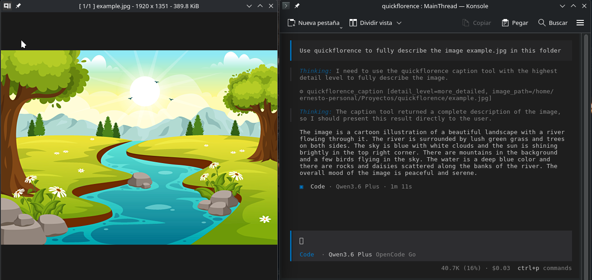

# QuickFlorence

MCP Server for Florence-2 Large — a vision model for image understanding tasks including captioning, object detection, OCR, segmentation, and more.



## Prerequisites: Install `uv`

QuickFlorence uses [`uv`](https://docs.astral.sh/uv/getting-started/installation/) for fast package installation and execution via `uvx`.

Install `uv` with:

```bash
curl -LsSf https://astral.sh/uv/install.sh | sh
```

Alternative installation methods (pip, Homebrew, etc.) are available at [https://docs.astral.sh/uv/getting-started/installation/](https://docs.astral.sh/uv/getting-started/installation/).

## Installation & First Run

**Important:** Run the following command in your terminal **before** configuring QuickFlorence in your IDE:

```bash
uvx --from git+https://github.com/erniomaldo/quickflorence quickflorence
```

This first run is necessary because:

- The Florence-2-large model (~several GB) downloads automatically to `~/.cache/huggingface`
- Dependencies (torch, transformers, etc.) are installed
- Initial model loading takes ~30+ seconds
- If you skip this step, your IDE's MCP connection timeout may fail while the model downloads/loads

After the first successful run, the model is cached and subsequent starts are much faster.

## IDE Configuration (KiloCode / OpenCode)

Add the following to your `opencode.jsonc` (or equivalent MCP config):

```json
"quickflorence": {
  "type": "local",
  "command": [
    "uvx",
    "--from",
    "git+https://github.com/erniomaldo/quickflorence",
    "quickflorence"
  ],
  "enabled": true
}
```

## Available MCP Tools

All Florence-2 tools accept an optional `model` parameter (alias or HF ID) to switch models per-call without restarting the server. Models are cached in memory so switching is instant after first load.

| Tool | Description | Parameters |
|---|---|---|
| `list_florence_models` | List all available Florence-2 models with aliases | _(none)_ |
| `caption` | Generate a text caption describing an image | `image_path`, `detail_level`, `model` (optional) |
| `detect_objects` | Detect objects with bounding boxes and labels | `image_path`, `model` (optional) |
| `dense_region_caption` | Generate captions for every region with bounding boxes | `image_path`, `model` (optional) |
| `phrase_grounding` | Find and localize a specific phrase within an image | `image_path`, `phrase`, `model` (optional) |
| `segment_by_expression` | Segment regions matching a referring expression | `image_path`, `expression`, `model` (optional) |
| `ocr` | Extract text from an image (OCR) | `image_path`, `with_regions`, `model` (optional) |
| `analyze_image` | Generic Florence2 inference for any supported task | `image_path`, `task_mode`, `text_input`, `model` (optional) |

### Model Aliases

Use these short aliases in the `model` parameter:

| Alias | HuggingFace ID | RAM (est.) | Speed vs Large | Use Case |
|-------|---------------|-----------|----------------|----------|
| `florence2-base` | `microsoft/Florence-2-base` | ~600MB | ~3x faster | Quick inference, limited RAM |
| `florence2-large` | `microsoft/Florence-2-large` | ~2GB | reference | Best quality (default) |
| `florence2-base-ft` | `microsoft/Florence-2-base-ft` | ~600MB | ~3x faster | Fine-tuned base variant |
| `florence2-large-ft` | `microsoft/Florence-2-large-ft` | ~2GB | reference | Fine-tuned large variant |

You can also pass the full HuggingFace ID directly (e.g., `"microsoft/Florence-2-base"`).

### Model Selection Strategies

**Per-call (recommended for flexibility):** Pass `model="florence2-base"` to any tool call. Models are cached in memory, so switching between base and large is instant after first load.

**Global default:** Set the `FLORENCE_MODEL` environment variable before starting the server:

```bash
export FLORENCE_MODEL="microsoft/Florence-2-base"
uvx --from git+https://github.com/erniomaldo/quickflorence quickflorence
```

This sets the default model for all tool calls that don't specify `model` explicitly.

## Supported Task Modes

The `analyze_image` tool accepts any of these Florence-2 task modes:

| Task Mode | Description |
|---|---|
| `<CAPTION>` | Brief one-line caption |
| `<DETAILED_CAPTION>` | Detailed caption including background elements |
| `<MORE_DETAILED_CAPTION>` | Very thorough caption with fine details |
| `<OD>` | Object Detection — bounding boxes with labels |
| `<DENSE_REGION_CAPTION>` | Region-level captions with bounding boxes |
| `<CAPTION_TO_PHRASE_GROUNDING>` | Ground a text phrase to bounding boxes |
| `<REFERRING_EXPRESSION_SEGMENTATION>` | Segment regions matching an expression |
| `<OCR>` | Extract text without coordinates |
| `<OCR_WITH_REGION>` | Extract text with bounding box coordinates |

## Environment Variables

| Variable | Default | Description |
|----------|---------|-------------|
| `FLORENCE_MODEL` | `florence2-large` | Default model alias or HF ID. Overridden by per-call `model` parameter. Accepts aliases (`florence2-base`) or full HF IDs (`microsoft/Florence-2-base`). |
| `QUICKFLORENCE_DEVICE` | auto-detect | Device override: `cuda`, `cuda:N`, `rocm`, or `cpu`. |

## System Requirements

- **`uv`** (includes `uvx`) — Python package installer and runner. See [installation guide](https://docs.astral.sh/uv/getting-started/installation/)
- **Python >= 3.10**
- **GPU recommended** (CUDA) — CPU fallback works but is slower
- **Disk space** — several GB for the model cache at `~/.cache/huggingface`

## Project Structure

```
quickflorence/
├── pyproject.toml
├── requirements.txt
└── quickflorence/
    ├── __init__.py
    ├── server.py
    └── florence_client.py
```

## Important Notes

- The model downloads automatically on first run
- HuggingFace cache is stored at `~/.cache/huggingface`
- Uses stdio transport (MCP compatible)
- Automatically detects and uses CUDA if available, falls back to CPU
